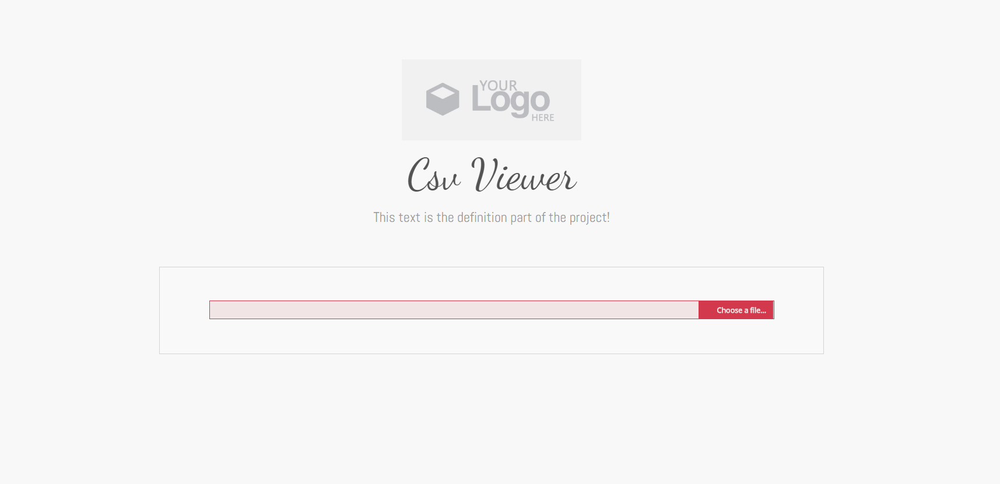
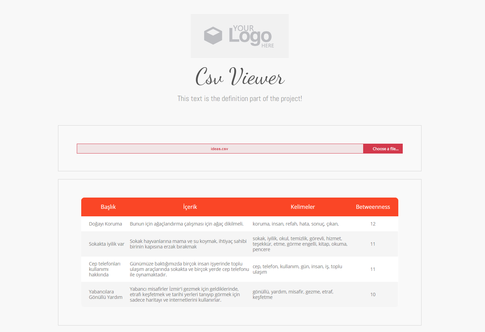

# CSV Viewer

Uygulama sayfası belirli data formatı için tasarlanmıştır. Kendi veri formatı, sütun sayısına göre kolay değiştirilebilir kodlanmıştır. Projenin amacı daha geniş csv gösterme ve işleme sistemi için temel niteliğindedir. Data visualization sayfasına veri hazırlama adımlarından birincisidir.

**csv files** klasörü altında barındırılan -idea.csv dosyası içerisinde data formatını gözlemleyebilirsiniz.

**Data Format:**
>Başlık, Metin, Metinin içerdiği kelimeler, Betwenness

"Betwenness: Network analysis alanında üzerinden geçen bağ ilişkisini temsil eder."

- **Kullanıcıyı firma logosu ve firma sub-domain adı, tanımı ve bir adet dosya seçme alanı karşılamaktadır.**

- **Seçilen .csv dosyasının uygunluğuna göre (Format uygunsuzsa hata mesajı gösterilmektedir.) veriler "index.html" içerisinde girilen tablo sütun başlıklarına göre listelenmektedir.**

